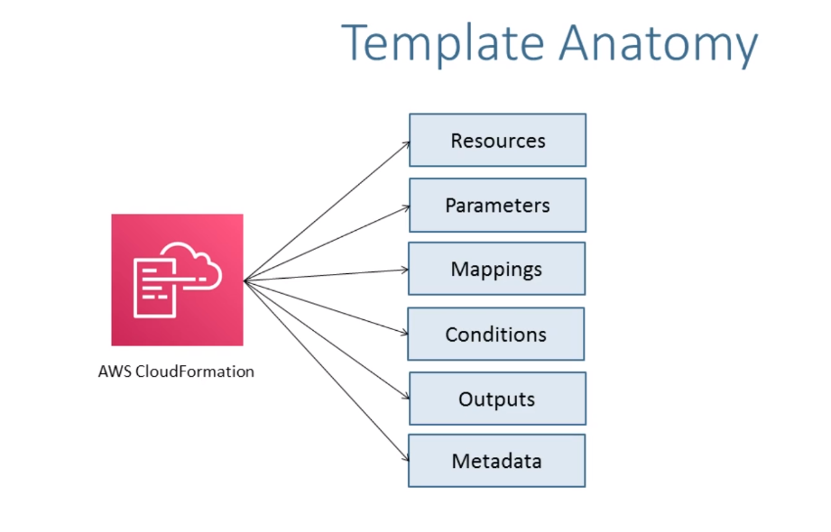
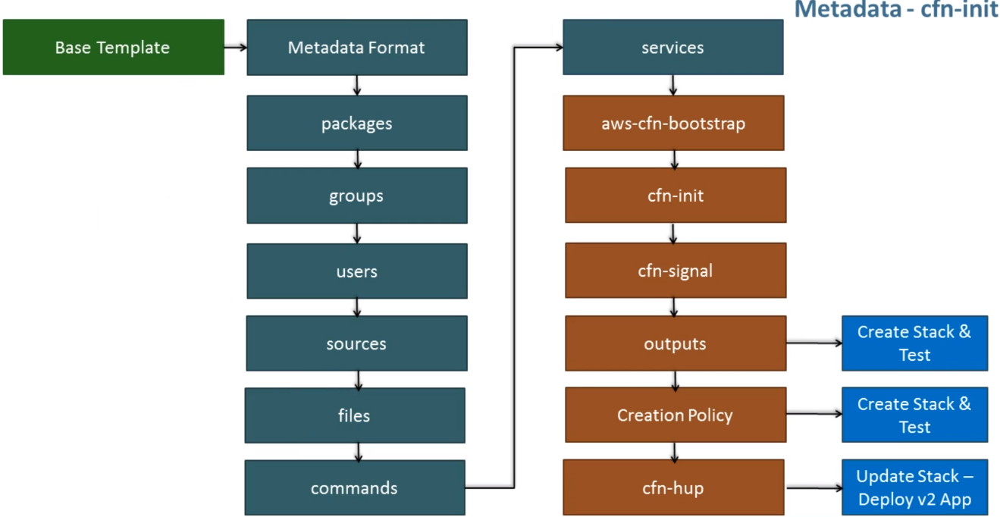
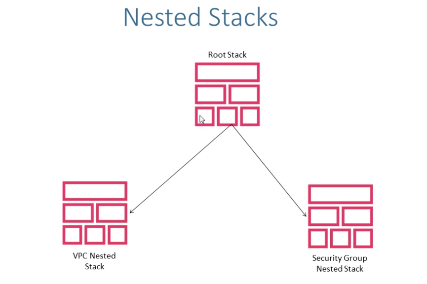
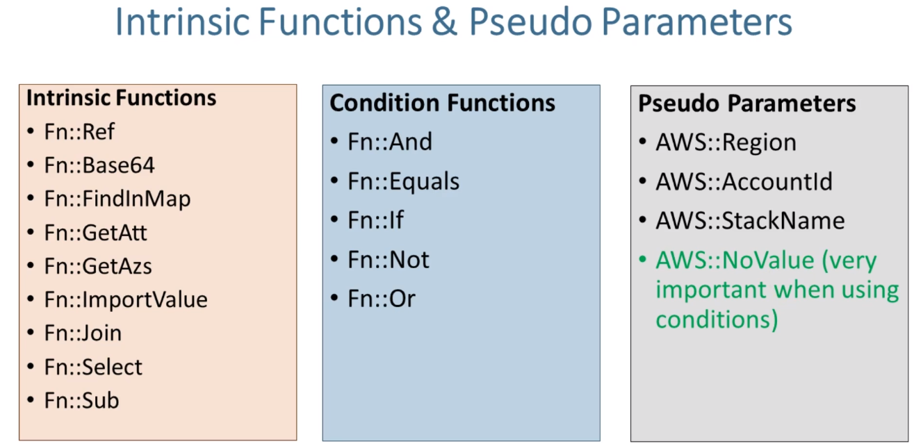
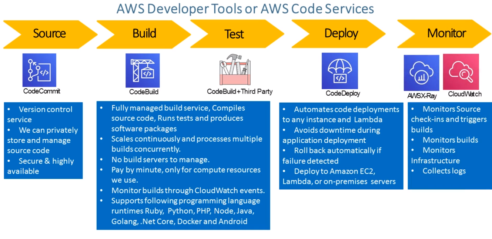

# aws-cloudformation

Guide on AWS CloudFormation

---

## Introduction

---

### CloudFormation Template Anatomy

### Metadata cfn-init

### Nested Stack

### Intrinsic Functions

### AWS Developer Tools

## Stack Features

- Create Stack
- Update Stack
- Create Change Sets
- Rollback
